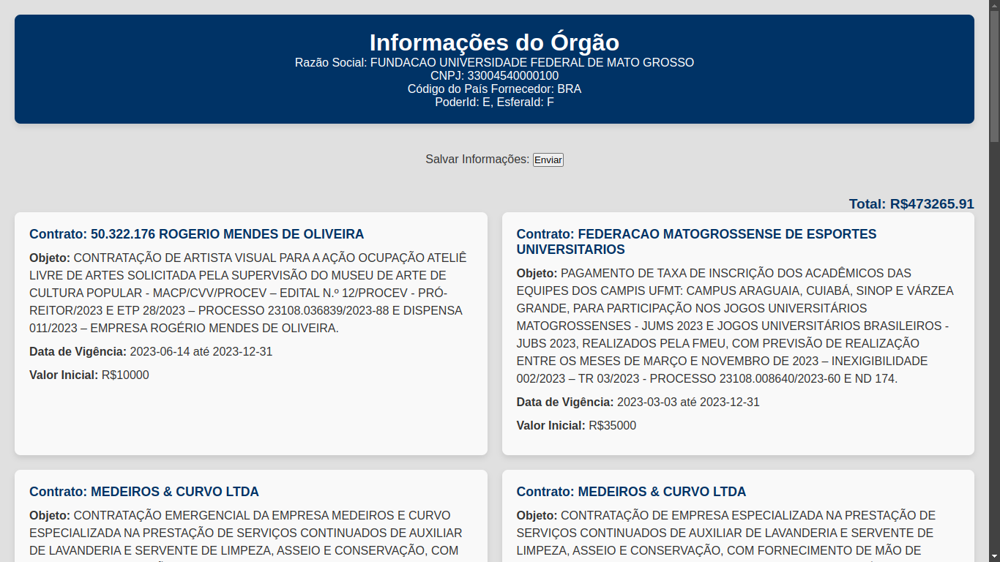
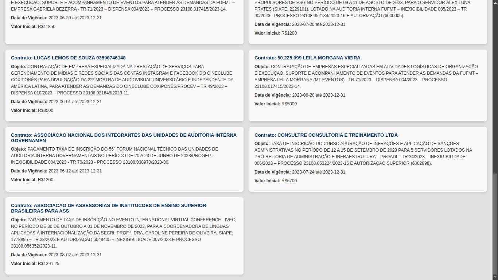
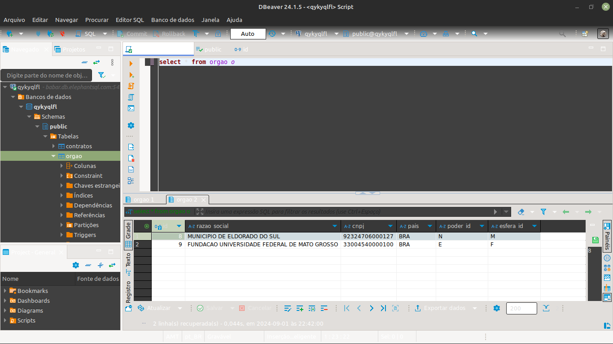
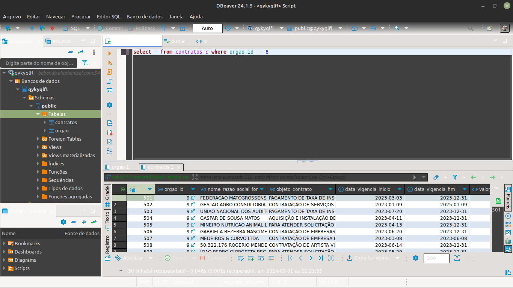

# API-PNCP
Repositório para a fase de teste prático para o NUTI-IC 

  <b>Informações técnicas:</b>
  <ul>
    <li>Linguagem: <i>PHP</i></li>
    <li>Banco de Dados: <i>Postgresql</i></li> 
    <li>IDE Banco de Dados: <i>DBeaver</i></li>
  </ul>

  A aplicação com integração da API do PNCP tem sua URL modificável no arquivo <i>index.php</i>. 
  Na página principal teremos o orgão em questão mais acima e os seus contratos abaixo. 
  

  No botão "Enviar" irá ficar com a inserção dos dados no nosso Banco de Dados. 
  

  Caso o usuário escolha salvar as informações, enviamos ao banco de dados.
  Mostrando nesse exemplo os orgãos cadastrados e todos contratos respectivamente 
  

    
    
  

